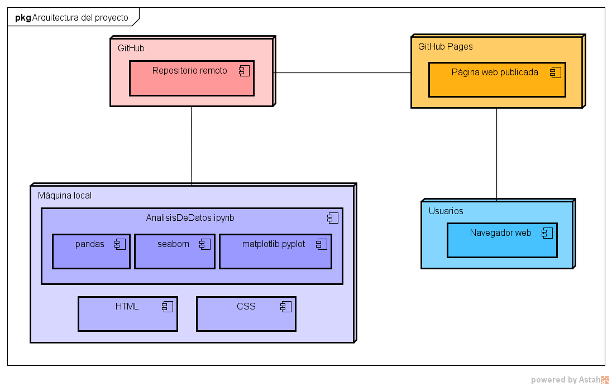

# Análisis de Longevidad en América Central

Conclusiones del proyecto

## Tabla de contenidos

1. [Análisis comparativo de factores socioculturales y económicos que han afectado la longevidad de las personas en la región de América Central (AC) entre los años del 2010 al 2022](#Nombre)
2. [Descripción](#Descripción)
3. [Arquitectura](#Arquitectura)
4. [Proceso](#Proceso)
5. [Funcionalidades](#Funcionalidades)
6. [Estado del proyecto](#EstadoDelProyecto)

### Nombre
* Nombre del proyecto: Análisis comparativo de factores socioculturales y económicos que han afectado la longevidad de las personas en la región de América Central (AC) entre los años del 2010 al 2022

### Descripción
* Breve descripción del proyecto: Proyecto en Python sobre análisis comparativo de factores socioculturales y económicos que han afectado la longevidad de las personas en la región de América Central (AC) entre los años del 2010 al 2022
-> Alguna imagen o gif que muestre el proyecto **pendiente**

### Arquitectura
* Arquitectura del proyecto + imagen **preliminar**
    La arquitectura del proyecto se puede visualizar a través del siguiente diagrama de despliegue:
     **pendiente**

### Proceso
* Fuente del dataset: [Banco Mundial](https://databank.worldbank.org/reports.aspx?source=world-development-indicators#)

* Limpieza de datos
    - Limpieza inicial de datos:
    

    - Limpieza por cada dataframe creado:
    
    **NOTA:** Se realiza una limpieza similar para cada dataframe creado, que corresponde a un indicador de interés.

* Manejo excepciones/control errores: En nuestro caso, no tenemos ninguna excepción, por lo que no es necesario controlar errores.

* Estadísticos (Valores, gráficos, …):
    - Mostrar contenido del dataframe del indicador correspondiente:
    

    - Gráfico de líneas del indicador (muestra la evolución del indicador en el tiempo):
    

    - Gráfico de barras de media del indicador (muestra el promedio del indicador en cada país):
    

    - Datos estadísticos (media, promedio, desviación estándar, …):
    

    **NOTA:** Se realiza una proceso similar para cada indicador.

### Funcionalidades
* Funcionalidades extra: 

- Integración del proyecto en una pág web
    - Tecnología/Herramientas usadas: HTML, CSS, Tailwind
    - Arquitectura (img):
    La arquitectura del proyecto junto con la integración en una página web se puede visualizar a través del siguiente diagrama de despliegue:
    