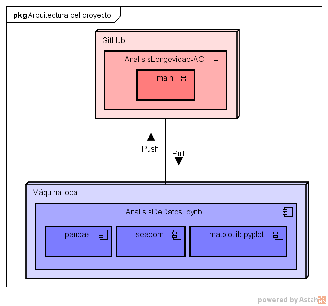
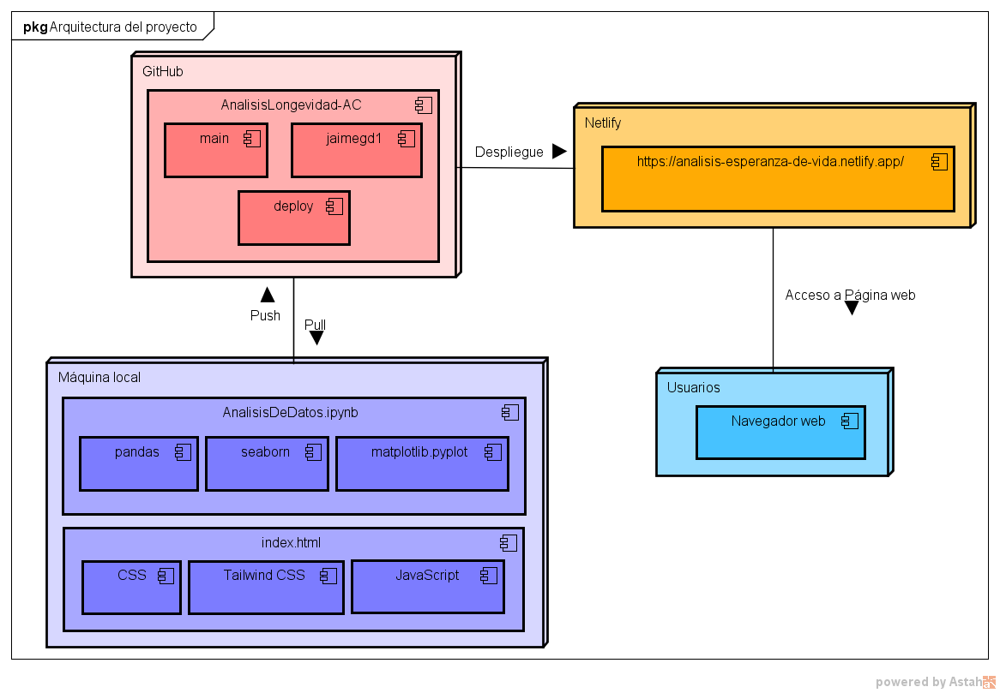

# Análisis de Longevidad en América Central

**Conclusiones del proyecto:** Analizando cada uno de los indicadores y su evolución a través del tiempo, apoyándonos de los gráficos y estadísticos que se generan, se puede concluir que:
- Hay diferentes factores que han afectado la longevidad de las personas en América Central (AC) entre los años del 2010 al 2022, algunos de estos pueden afectar la calidad de vida directamente, mientras que otros pueden tener un impacto indirecto.
- Al comparar cada uno de los indicadores contra el indicador de esperanza de vida, se puede observar que los países que tienen mejor calidad de vida son Costa Rica y Panamá, quienes en general tienen un mejor control de los servicios básicos (sanitarios, energéticos, etc.), además de tener un mayor Ingreso Nacional Neto Ajustado per cápita y un mayor PIB per cápita en la región centroamericana.
- Panamá y Costa Rica son los países con mayor calidad de vida en América Central, pero hay otros países que tienen un mayor immigración y menor emigración en la región, esto puede indicar que la calidad de vida es bastante buena provocando que pocos emigren y en cambio más personas inmigran a estos países.
- En general, la esperanza de vida en América Central ronda entre los 71 a 78 años en promedio, pero los países con mayor esperanza de vida son Panamá con un promedio de 77 años y Costa Rica con un promedio de 78 años.

## Tabla de contenidos

1. [Nombre](#Nombre)
2. [Descripción](#Descripción)
3. [Arquitectura](#Arquitectura)
4. [Proceso](#Proceso)
5. [Funcionalidades](#Funcionalidades)
6. [Estado del proyecto](#EstadoDelProyecto)

### Nombre
* Análisis comparativo de factores socioculturales y económicos que han afectado la longevidad de las personas en la región de América Central (AC) entre los años del 2010 al 2022

### Descripción
* Proyecto en Python sobre análisis comparativo de factores socioculturales y económicos que han afectado la longevidad de las personas en la región de América Central (AC) entre los años del 2010 al 2022

-> Alguna imagen o gif que muestre el proyecto **pendiente**

### Arquitectura
* Arquitectura del proyecto + imagen
    
    La arquitectura del proyecto se puede visualizar a través del siguiente diagrama de despliegue:
    
    
    El funcionamiento del proyecto se puede visualizar a través del siguiente diagrama de flujo:

     **pendiente**

### Proceso
* **Fuente del dataset:** [Banco Mundial](https://databank.worldbank.org/reports.aspx?source=world-development-indicators#)

* **Limpieza de datos**
    - Limpieza inicial de datos:
    

    - Limpieza por cada dataframe creado:
    
    **NOTA:** Se realiza una limpieza similar para cada dataframe creado, que corresponde a un indicador de interés.

* **Manejo excepciones/control errores:** En nuestro caso, no tenemos ninguna excepción, por lo que no es necesario controlar errores.

* **Estadísticos (Valores, gráficos, …):**
    - Mostrar contenido del dataframe del indicador correspondiente:
    

    - Gráfico de líneas del indicador (muestra la evolución del indicador en el tiempo):
    

    - Gráfico de barras de media del indicador (muestra el promedio del indicador en cada país):
    

    - Datos estadísticos (media, promedio, desviación estándar, …):
    

    **NOTA:** Se realiza un proceso similar para cada indicador.
 
### Funcionalidades
* ***Funcionalidades extra:*** 

- **Integración del proyecto en una pág web**
    - Tecnología/Herramientas usadas: HTML, CSS, Tailwind
    - Arquitectura (img):
    La arquitectura del proyecto junto con la integración en una página web se puede visualizar a través del siguiente diagrama de despliegue:
    

### EstadoDelProyecto
* Estado del proyecto: **En desarrollo**